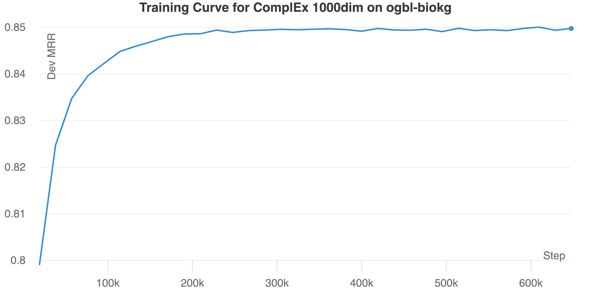
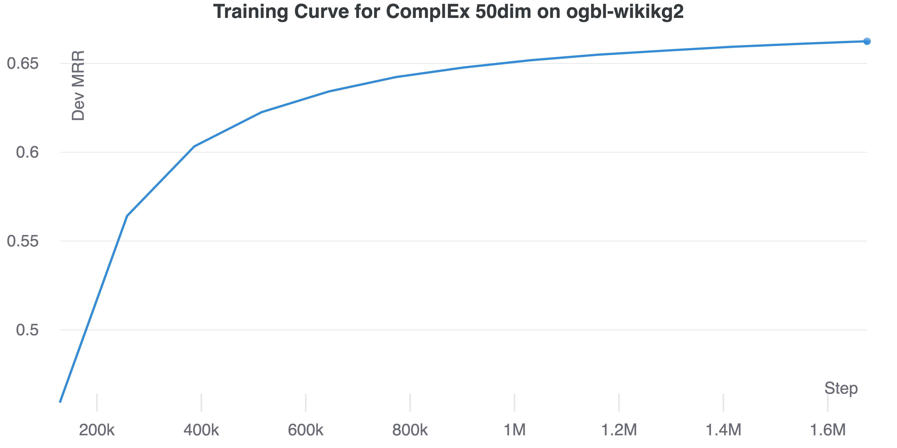

# Relation Prediction as an Auxiliary Training Objective for Knowledge Graph Completion
[](https://paperswithcode.com/sota/link-property-prediction-on-ogbl-wikikg2?p=relation-prediction-as-an-auxiliary-training)
[](https://paperswithcode.com/sota/link-property-prediction-on-ogbl-biokg?p=relation-prediction-as-an-auxiliary-training)
[](https://paperswithcode.com/sota/link-prediction-on-codex-large?p=relation-prediction-as-an-auxiliary-training)
[](https://paperswithcode.com/sota/link-prediction-on-codex-medium?p=relation-prediction-as-an-auxiliary-training)
[](https://paperswithcode.com/sota/link-prediction-on-codex?p=relation-prediction-as-an-auxiliary-training)
[](https://paperswithcode.com/sota/link-prediction-on-aristo-v4?p=relation-prediction-as-an-auxiliary-training) 
[](https://paperswithcode.com/sota/link-prediction-on-fb15k-237?p=relation-prediction-as-an-auxiliary-training) 
[](https://paperswithcode.com/sota/link-prediction-on-wn18rr?p=relation-prediction-as-an-auxiliary-training)

This repo contains the code accompanying the paper: [“Relation Prediction as an Auxiliary Training Objective for Improving Multi-Relational Graph Representations”](https://openreview.net/pdf?id=Qa3uS3H7-Le). We found that incorporating relation prediction into the 1vsAll objective yields a new self-supervised training objective for knowledge base completion (KBC), which results in significant performance improvement (up to 9.9% in Hits@1) by adding as little as 3–10 lines of code. Unleash the true power of your KBC models with the relation prediction objective! 

The codebase also comes with SoTA results on several KBC datasets. Echoing [previous research](https://openreview.net/forum?id=BkxSmlBFvr), we find that traditional factorisation-based models, e.g. ComplEx, DistMult and RESCAL, can outperform more recently proposed models when trained appropraitely. For most cases, we find the 1vsAll + Relation Prediction objective to be very effective and require less tweaking than more sophisticated architectures.


## Table of Contents
[:zap: Link Prediction Results](https://github.com/facebookresearch/ssl-relation-prediction#zap-link-prediction-results)
- [ogbl-wikikg2](https://github.com/facebookresearch/ssl-relation-prediction#ogbl-wikikg2)
- [ogbl-biokg](https://github.com/facebookresearch/ssl-relation-prediction#ogbl-biokg)
- [CoDEx-S](https://github.com/facebookresearch/ssl-relation-prediction#codex-s)
- [CoDEx-M](https://github.com/facebookresearch/ssl-relation-prediction#codex-m)
- [CoDEx-L](https://github.com/facebookresearch/ssl-relation-prediction#codex-l)
- [WN18RR](https://github.com/facebookresearch/ssl-relation-prediction#wn18rr)
- [FB15K-237](https://github.com/facebookresearch/ssl-relation-prediction#fb15k237)
- [Aristo-v4](https://github.com/facebookresearch/ssl-relation-prediction#aristo-v4)

[:compass: How to Use This Repo](https://github.com/facebookresearch/ssl-relation-prediction#how-to-use-this-repo)
- [How to Use This Repo for OGB Datasets](https://github.com/facebookresearch/ssl-relation-prediction#how-to-use-this-repo-for-ogb-datasets)
- [How to Use This Repo for Conventional KBC Datasets](https://github.com/facebookresearch/ssl-relation-prediction#how-to-use-this-repo-for-conventional-kbc-datasets)
- [Dependency](https://github.com/facebookresearch/ssl-relation-prediction#dependency)

[:smiling_face_with_three_hearts: Acknowledgement](https://github.com/facebookresearch/ssl-relation-prediction#acknowledgement)

[:page_with_curl: Citation](https://github.com/facebookresearch/ssl-relation-prediction#citation)

[:white_check_mark: Licence](https://github.com/facebookresearch/ssl-relation-prediction#license)

## News
- 01/12/2021 Hyper-parameters on CoDEx, ogbl-biokg and ogbl-wikikgv2 are released [here](https://github.com/facebookresearch/ssl-relation-prediction/blob/main/doc/hyper-parameters)

## :zap: Link Prediction Results
We attempt to include as many results as possible for recent knowledge graph completion datasets and release the [hyper-parameters](https://github.com/facebookresearch/ssl-relation-prediction/blob/main/doc/hyper-parameters) to foster easy reproduction. Feel free to create an issue if you want to suggest additional datasets for us to include.

Currently, we have results on the OGB link property prediction dataset [ogbl-biokg](https://ogb.stanford.edu/docs/linkprop/#ogbl-biokg), [ogbl-wikikg2](https://ogb.stanford.edu/docs/linkprop/#ogbl-wikikg2), [codex](https://arxiv.org/pdf/2009.07810.pdf), [Aristo-v4](https://allenai.org/data/tuple-kb), [FB15K237](https://www.microsoft.com/en-us/download/details.aspx?id=52312), and [WN18RR](https://github.com/TimDettmers/ConvE/blob/master/WN18RR.tar.gz). **All training was done on a single 16GB GPU except for ogbl-wikikg2 which was run on a 32GB GPU**. 

### ogbl-wikikg2 
| Model                  | Params | Using RP? | MRR        | Hits@1     | Hits@3     | Hits@10    |
|:---------------------- |:------ |:--------- |:---------- |:---------- |:---------- |:---------- |
| ComplEx (50dim)[^3]    | 250M   | No        | 0.3804     | -          | -          | -          |
| ComplEx (250dim)[^3]   | 1B     | No        | 0.4027     | -          | -          | -          |
| ComplEx (25dim, ours)  | 125M   | No        | 0.5161     | 0.4576     | 0.5310     | 0.6324     |
| ComplEx (25dim, ours)  | 125M   | Yes       | 0.5192     | 0.4540     | 0.5394     | 0.6483     |
| ComplEx (50dim, ours)  | 250M   | No        | 0.6193     | 0.5503     | 0.6468     | 0.7589     |
| ComplEx (50dim, ours)  | 250M   | Yes       | 0.6392     | 0.5684     | 0.6686     | 0.7822     |
| ComplEx (100dim, ours) | 500M   | No        | 0.6458     | 0.5750     | 0.6761     | 0.7896     |
| ComplEx (100dim, ours) | 500M   | Yes       | **0.6509** | **0.5814** | **0.6800** | **0.7923** |

Note that the training of 50/100 dim takes about 3 days and that additional training time will likely lead to better results. We currently use only one 32GB GPU. Acceleration on multiple GPUs will be considered in the future.

### ogbl-biokg 

| Model          | Params | Using RP? | MRR        | Hits@1     | Hits@3     | Hits@10    |
|:-------------- |:------ | --------- |:---------- |:---------- |:---------- |:---------- |
| ComplEx [^2]   | 188M   | No        | 0.8095     | -          | -          | -          |
| ComplEx (ours) | 188M   | No        | 0.8482     | 0.7887     | **0.8913** | 0.9536     |
| ComplEx (ours) | 188M   | Yes       | **0.8494** | **0.7915** | 0.8902     | **0.9540** |

### CoDEx-S

| Model          | Using RP? | MRR       | Hits@1    | Hits@3    | Hits@10   |
|:-------------- | --------- |:--------- |:--------- | --------- |:--------- |
| ComplEx [^1]   | No        | 0.465     | 0.372     | 0.504     | 0.646     |
| ComplEx (1000dim, ours) | No        | 0.472     | **0.378** | 0.508     | 0.658     |
| ComplEx (1000dim, ours) | Yes       | **0.473** | 0.375     | **0.514** | **0.663** |

### CoDEx-M

| Model        | Using RP? | MRR       | Hits@1    | Hits@3    | Hits@10   |
|:------------ | --------- |:--------- |:--------- | --------- |:--------- |
| ComplEx [^1] | No        | 0.337     | 0.262     | 0.370     | 0.476     |
| ComplEx (1000dim, ours)     | No        | 0.351     | 0.276     | 0.385     | **0.492** |
| ComplEx (1000dim, ours)     | Yes       | **0.352** | **0.277** | **0.386** | 0.490     |


### CoDEx-L

| Model        | Using RP? | MRR       | Hits@1    | Hits@3    | Hits@10   |
|:------------ | --------- |:--------- |:--------- | --------- |:--------- |
| ComplEx [^1] | No        | 0.294     | 0.237     | 0.318     | 0.400     |
| ComplEx (1000dim, ours)     | No        | 0.342     | 0.275     | 0.374     | 0.470     |
| ComplEx (1000dim, ours)     | Yes       | **0.345** | **0.277** | **0.377** | **0.473** |

### WN18RR

| Model   | Using RP? | MRR       | Hits@1    | Hits@3    | Hits@10   |
|:------- | --------- |:--------- |:--------- | --------- |:--------- |
| ComplEx | No        | 0.487     | 0.441     | 0.501     | **0.580** |
| ComplEx | Yes       | **0.488** | **0.443** | **0.505** | 0.578     |

### FB15K237

| Model   | Using RP? | MRR       | Hits@1    | Hits@3    | Hits@10   |
|:------- | --------- |:--------- |:--------- |:--------- |:--------- |
| ComplEx | No        | 0.366     | 0.271     | 0.401     | 0.557     |
| ComplEx | Yes       | **0.388** | **0.298** | **0.425** | **0.568** |

### Aristo-v4

| Model   | Using RP? | MRR       | Hits@1    | Hits@3    | Hits@10   |
|:------- | --------- |:--------- |:--------- | --------- |:--------- |
| ComplEx | No        | 0.301     | 0.232     | 0.324     | 0.438     |
| ComplEx | Yes       | **0.311** | **0.240** | **0.336** | **0.447** |

[^1]: The results are taken from [the awesome CoDEx repo](https://github.com/tsafavi/codex). 

[^2]: The results are taken from [OGB Link Property Prediction Leaderboard on ogbl-biokg](https://ogb.stanford.edu/docs/leader_linkprop/#ogbl-biokg).

[^3]: The results are taken from [OGB Link Property Prediction Leaderboard on ogbl-wikikg2](https://ogb.stanford.edu/docs/leader_linkprop/#ogbl-wikikg2).

## How to Use This Repo
### How to Use This Repo for OGB Datasets
Edit `preprocess_datasets.py` and specify the dataset you want to run on, either
```
datasets = ['ogbl-wikikg2']
```
or
```
datasets = ['ogbl-biokg']
```
Then run `preprocess_datasets.py` as follows
```
mkdir data/
python preprocess_datasets.py
```
After preprocessing is complete, a model can be trained by running `main.py`. For example, to train ComplEx on ogbl-biokg, use the following command
```
python main.py --dataset ogbl-biokg --model ComplEx --score_rel True --rank 1000 --learning_rate 1e-1 --batch_size 500 --optimizer Adagrad --regularizer N3 --lmbda 0.01 --w_rel 0.25 --valid 1 
```
and to train a ComplEx on ogbl-wikikg2, use the following command on a GPU with 32GB memory
```
python main.py --dataset ogbl-wikikg2 --model ComplEx --score_rel True --rank 50 --learning_rate 1e-1 --batch_size 250 --optimizer Adagrad --regularizer N3 --lmbda 0.1 --w_rel 0.125 --valid 1 
```
You should obtain training curves similar as the figures below.

ogbl-biokg                     |  ogbl-wikikg2
:-----------------------------:|:------------------------------:
  | 


### How to Use This Repo for Conventional KBC Datasets or Customized Datasets
#### Prepare Datasets
- Download the datasets and place them under `src_data`. 
- Name the file containing training triplets as `train`, validation triplets as `valid` and test triplets as `test`. The folder should look like this
```
src_data/FB15K-237/train # Tab separated file, each row should be like `head    relation    tail`
src_data/FB15K-237/valid # Tab separated file, each row should be like `head    relation    tail`
src_data/FB15K-237/test # Tab separated file, each row should be like `head    relation    tail`
```
- After downloading the datasets, the preprocessing is quick and can be completed within a few minutes. First, edit `preprocess_datasets.py` and specify the dataset you want to run on, e.g.
```
datasets = ['custom_graph']
```
then run
```
mkdir data/
python preprocess_datasets.py
```

You can download together UMLS, Nations, Kinship, FB15K-237, WN18RR from [here](https://github.com/villmow/datasets_knowledge_embedding) and aristo-v4 from [here](https://allenai.org/data/tuple-kb). You can also download some datasets separately on [WN18RR](https://github.com/TimDettmers/ConvE/blob/master/WN18RR.tar.gz) and [FB15K-237](https://www.microsoft.com/en-us/download/details.aspx?id=52312). 
#### Train the model 
Use the option `score_rel` to enable the auxiliary relation prediction objective. Use the option `w_rel` to set the weight of the relation prediction objective.

For example, the following command trains a ComplEx model **with** with the auxiliary relation prediction objective on FB15K-237
```
python main.py --dataset FB15K-237 --score_rel True --model ComplEx --rank 1000 --learning_rate 0.1 --batch_size 1000 --lmbda 0.05 --w_rel 4 --max_epochs 100
```
And the following command trains a ComplEx model **without** the auxiliary relation prediction objective on FB15K-237
```
python main.py --dataset FB15K-237 --score_rel False --model ComplEx --rank 1000 --learning_rate 0.1 --batch_size 1000 --lmbda 0.05 --w_rel 4 --max_epochs 100
```

## Dependencies
- pytorch
- wandb

## Acknowledgement
This repo is based on the repo [kbc](https://github.com/facebookresearch/kbc), which provides efficient implementations of 1vsAll for ComplEx and CP. Our repo also includes implementations for other models: TransE, RESCAL, and TuckER. 

## Citation
If you find this repo useful, please cite us
```
@inproceedings{
chen2021relation,
title={Relation Prediction as an Auxiliary Training Objective for Improving Multi-Relational Graph Representations},
author={Yihong Chen and Pasquale Minervini and Sebastian Riedel and Pontus Stenetorp},
booktitle={3rd Conference on Automated Knowledge Base Construction},
year={2021},
url={https://openreview.net/forum?id=Qa3uS3H7-Le}
}
```
## License
This repo is CC-BY-NC licensed, as found in the LICENSE file.


