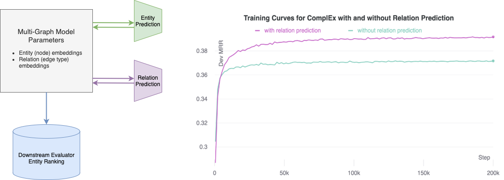

# Relation Prediction as an Auxiliary Training Objective for Knowledge Graph Completion
[](https://paperswithcode.com/sota/link-prediction-on-codex-large?p=relation-prediction-as-an-auxiliary-training)
[](https://paperswithcode.com/sota/link-prediction-on-codex-medium?p=relation-prediction-as-an-auxiliary-training)
[](https://paperswithcode.com/sota/link-prediction-on-codex?p=relation-prediction-as-an-auxiliary-training)
[](https://paperswithcode.com/sota/link-prediction-on-aristo-v4?p=relation-prediction-as-an-auxiliary-training) 
[](https://paperswithcode.com/sota/link-prediction-on-fb15k-237?p=relation-prediction-as-an-auxiliary-training) 
[](https://paperswithcode.com/sota/link-prediction-on-wn18rr?p=relation-prediction-as-an-auxiliary-training)

This repo provides the code for the paper [Relation Prediction as an Auxiliary Training Objective for Improving Multi-Relational Graph Representations](https://openreview.net/pdf?id=Qa3uS3H7-Le). Incorporating relation prediction into the 1vsAll objective leads to a new self-supervised training objective for knowledge base completion (KBC), which brings significant performance improvement (up to 9.9% in Hits@1) with 3-10 extra lines of code. Unleash the power of your KBC models with relation prediction objective! 

The codebase also comes with SoTA results on the latest KBC datasets. Echoing with [previous research](https://openreview.net/forum?id=BkxSmlBFvr), we find that the traditional factorisation-based models, e.g. ComplEx, DistMult and RESCAL, can actually be very powerful if we train them appropraitely. In most cases, we find the 1vsAll + Relation Prediction to be very effective and take much less tweaking efforts than getting sophisticated architectures to work.



## :zap: Link Prediction Results
We try to include as many results as possible on latest knowledge graph completion datasets and will release the hyper-parameters to foster easy reproduction. Feel free to create an issue if you want to suggest a new dataset for us to run.

Currently, we have results on OGB link property prediction dataset [ogbl-biokg](https://ogb.stanford.edu/docs/linkprop/#ogbl-biokg), [codex](https://arxiv.org/pdf/2009.07810.pdf), [Aristo-v4](https://allenai.org/data/tuple-kb), [FB15K237](https://www.microsoft.com/en-us/download/details.aspx?id=52312), and [WN18RR](https://github.com/TimDettmers/ConvE/blob/master/WN18RR.tar.gz). **All training was done on a single 16GB GPU**. 


### ogbl-biokg 

| Model          | Params | Using RP? | MRR        | Hits@1     | Hits@3     | Hits@10    |
|:-------------- |:------ | --------- |:---------- |:---------- |:---------- |:---------- |
| ComplEx [^2]   | 188M   | No        | 0.8095     | -          | -          | -          |
| ComplEx (ours) | 188M   | No        | 0.8482     | 0.7887     | **0.8913** | 0.9536     |
| ComplEx (ours) | 188M   | Yes       | **0.8494** | **0.7915** | 0.8902     | **0.9540** |

### CoDEx-S

| Model          | Using RP? | MRR       | Hits@1    | Hits@3    | Hits@10   |
|:-------------- | --------- |:--------- |:--------- | --------- |:--------- |
| ComplEx [^1]   | No        | 0.465     | 0.372     | 0.504     | 0.646     |
| ComplEx (ours) | No        | 0.472     | **0.378** | 0.508     | 0.658     |
| ComplEx (ours) | Yes       | **0.473** | 0.375     | **0.514** | **0.663** |

### CoDEx-M

| Model        | Using RP? | MRR       | Hits@1    | Hits@3    | Hits@10   |
|:------------ | --------- |:--------- |:--------- | --------- |:--------- |
| ComplEx [^1] | No        | 0.337     | 0.262     | 0.370     | 0.476     |
| ComplEx      | No        | 0.351     | 0.276     | 0.385     | **0.492** |
| ComplEx      | Yes       | **0.352** | **0.277** | **0.386** | 0.490     |


### CoDEx-L

| Model        | Using RP? | MRR       | Hits@1    | Hits@3    | Hits@10   |
|:------------ | --------- |:--------- |:--------- | --------- |:--------- |
| ComplEx [^1] | No        | 0.294     | 0.237     | 0.318     | 0.400     |
| ComplEx      | No        | 0.342     | 0.275     | 0.374     | 0.470     |
| ComplEx      | Yes       | **0.345** | **0.277** | **0.377** | **0.473** |

### WN18RR

| Model   | Using RP? | MRR       | Hits@1    | Hits@3    | Hits@10   |
|:------- | --------- |:--------- |:--------- | --------- |:--------- |
| ComplEx | No        | 0.487     | 0.441     | 0.501     | **0.580** |
| ComplEx | Yes       | **0.488** | **0.443** | **0.505** | 0.578     |

### FB15K237

| Model   | Using RP? | MRR       | Hits@1    | Hits@3    | Hits@10   |
|:------- | --------- |:--------- |:--------- |:--------- |:--------- |
| ComplEx | No        | 0.366     | 0.271     | 0.401     | 0.557     |
| ComplEx | Yes       | **0.388** | **0.298** | **0.425** | **0.568** |

### Aristo-v4

| Model   | Using RP? | MRR       | Hits@1    | Hits@3    | Hits@10   |
|:------- | --------- |:--------- |:--------- | --------- |:--------- |
| ComplEx | No        | 0.301     | 0.232     | 0.324     | 0.438     |
| ComplEx | Yes       | **0.311** | **0.240** | **0.336** | **0.447** |


## How to Use This Repo
### Prepare Datasets
#### Download
Download datasets and put them under `src_data`. The folder should look like this TODO: tree command output
```
src_data/FB15K-237/train # Tab separated file
src_data/FB15K-237/valid # Tab separated file
src_data/FB15K-237/test # Tab separated file
```

As an option, you can download together UMLS, Nations, Kinship, FB15K-237, WN18RR from [here](https://github.com/villmow/datasets_knowledge_embedding) and aristo-v4 from [here](https://allenai.org/data/tuple-kb). You can also download some datasets separately on [WN18RR](https://github.com/TimDettmers/ConvE/blob/master/WN18RR.tar.gz) and [FB15K-237](https://www.microsoft.com/en-us/download/details.aspx?id=52312). 

#### Preprocessing
The preprocess is very quick within several minutes.
```
mkdir data/
python preprocess_datasets.py
```

### Train the model 
Use option `score_rel` to turn on the auxiliary objective of relation prediction. Use option `w_rel` to set the weight of the relation prediction objective.

For example, the following command trains a ComplEx model **with** relation prediction on FB15K-237
```
python main.py --dataset FB15K-237 --score_rel True --model ComplEx --rank 1000 --learning_rate 0.1 --batch_size 1000 --lmbda 0.05 --w_rel 4 --max_epochs 100
```
And the following command trains a ComplEx model **without** relation prediction on FB15K-237
```
python main.py --dataset FB15K-237 --score_rel False --model ComplEx --rank 1000 --learning_rate 0.1 --batch_size 1000 --lmbda 0.05 --w_rel 4 --max_epochs 100
```

## Dependency
- pytorch
- wandb

# Acknowledgement
This repo is based on the repo [kbc](https://github.com/facebookresearch/kbc), which provides efficient implementations of 1vsAll for ComplEx and CP. Our repo also includes implementations for other models: TransE, RESCAL, and TuckER. 

# License
This repo is CC-BY-NC licensed, as found in the LICENSE file.


# Citation
If you find this repo useful, please cite us
```
@inproceedings{
chen2021relation,
title={Relation Prediction as an Auxiliary Training Objective for Improving Multi-Relational Graph Representations},
author={Yihong Chen and Pasquale Minervini and Sebastian Riedel and Pontus Stenetorp},
booktitle={3rd Conference on Automated Knowledge Base Construction},
year={2021},
url={https://openreview.net/forum?id=Qa3uS3H7-Le}
}
```

[^1]: The results are taken from [the awesome CoDEx repo](https://github.com/tsafavi/codex). 

[^2]: The results are taken from [OGB Link Property Prediction Leaderboard on ogbl-biokg](https://ogb.stanford.edu/docs/leader_linkprop/#ogbl-biokg).
